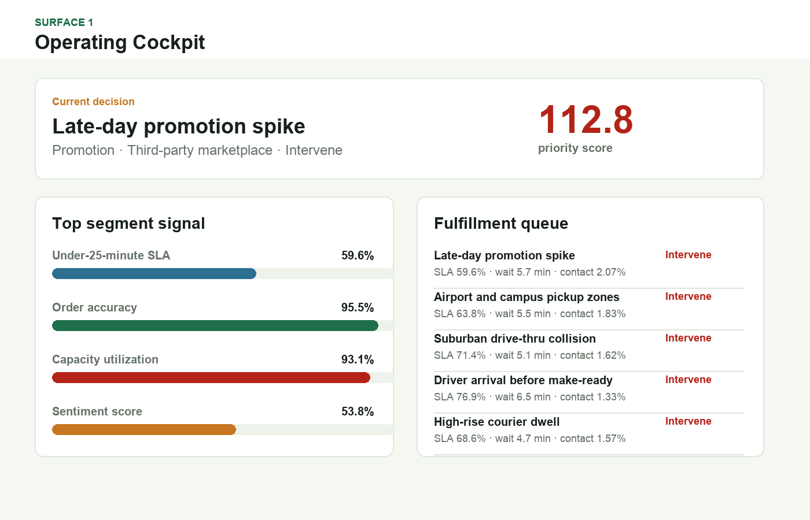
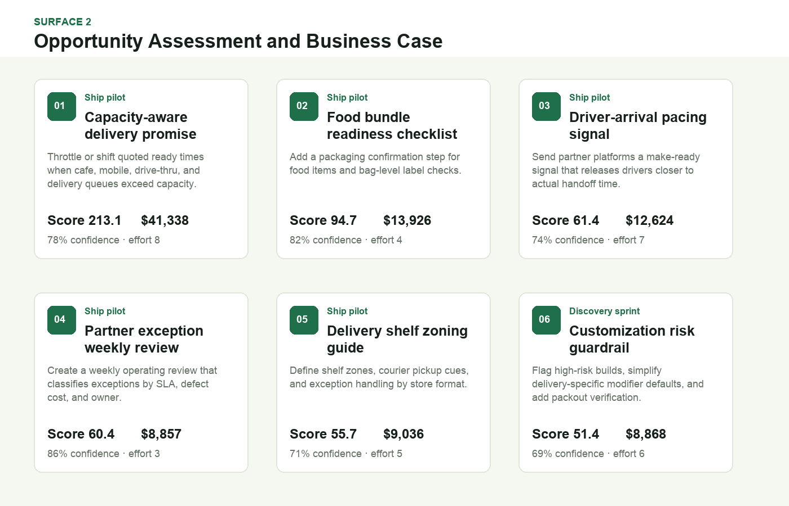
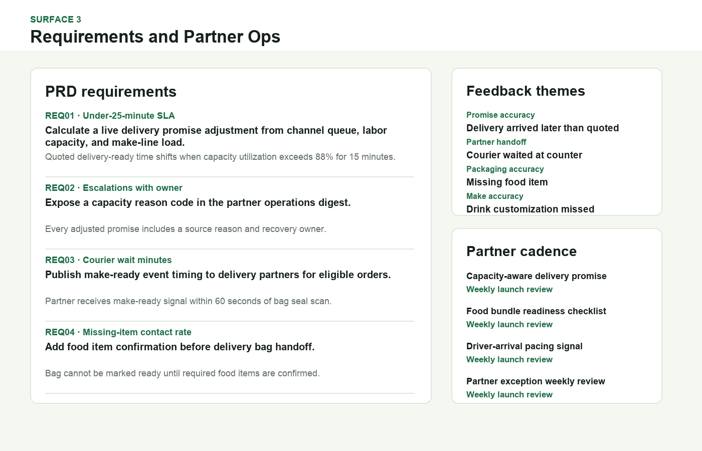

# Delivery Fulfillment Experience Optimization Studio

This is a product-operations artifact for a large coffeehouse and restaurant delivery program. It helps a digital product manager decide which delivery fulfillment improvements deserve discovery, pilot, or monitoring when customer experience, store capacity, partner requests, and internal constraints compete.

The artifact is intentionally more than a dashboard. It combines a performance cockpit, a business case ranking, PRD-style requirements, and a partner operations cadence.

## Screenshots



The operating cockpit ranks delivery scenarios by SLA gap, order accuracy, courier wait, capacity pressure, customer contact rate, and sentiment.



The opportunity surface turns the top fulfillment risks into a product roadmap with modeled monthly value, confidence, effort, partner complexity, and rollout recommendation.



The requirements surface documents acceptance criteria, owners, metrics, feedback themes, and partner review cadence so the roadmap is ready for cross-functional execution.

## What This Project Demonstrates

- Performance data analysis for delivery operations.
- User feedback analysis and prioritization.
- Opportunity assessment and business casing.
- Requirements documentation with acceptance criteria.
- Partner management and day-to-day operations workflow.
- Product judgment across customer experience, store execution, and third-party delivery constraints.

## Data

All operating data is synthetic and documented. It does not represent real company performance.

The data generation script models common structures in a scaled restaurant delivery network:

- Owned-app and third-party delivery channels.
- Morning rush, lunch, promotion, urban core, travel hub, and all-day fulfillment scenarios.
- Higher delivery ticket sizes and food attachment as a complexity driver.
- Average end-to-end delivery promises centered near 25 minutes.
- Prep time, courier handoff wait, travel time, store capacity, order accuracy, refunds, customer contacts, partner cancellations, and sentiment.

Synthetic distributions and assumptions:

- Daily order volume uses segment baselines with weekday, rush, promotion, and random demand multipliers.
- Prep, handoff, and delivery minutes use bounded normal distributions around scenario-specific baselines.
- SLA is derived from prep plus handoff plus delivery time, with penalties when total time exceeds the customer promise window.
- Refunds and customer contacts increase when accuracy falls, SLA weakens, or courier wait grows.
- Business case value is confidence-adjusted and penalized for effort and partner complexity.

Primary files:

- `data/delivery_segments.csv`
- `data/daily_metrics.csv`
- `data/feedback_themes.csv`
- `data/requirements_backlog.csv`
- `analysis/outputs/fulfillment_priority_queue.csv`
- `analysis/outputs/initiative_business_case.csv`
- `analysis/outputs/partner_ops_plan.csv`
- `analysis/outputs/prd_requirements.csv`

## Scope

This artifact shows how I would structure product discovery and operating decisions for delivery fulfillment. It does not connect to live point-of-sale, labor, loyalty, customer support, or delivery-partner APIs. The analysis is designed to be interview-defensible, reproducible, and honest about what is modeled.

## Run Locally

```bash
python3 scripts/score_operating_data.py
python3 -m http.server 4173
```

Then open `http://localhost:4173`.
